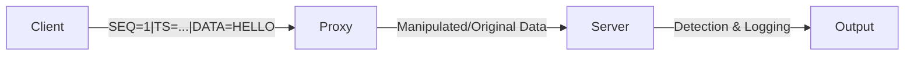

# MITM Detection System

A containerized simulation of Man-In-The-Middle (MITM) attacks and their detection mechanisms. This project demonstrates how sequence numbers, timestamps, and integrity checks can be used to identify common network-based attacks.

## 🏗️ Architecture

The system consists of three main components running in isolated Docker containers:

1.  **Client**: Generates and sends structured messages with sequence numbers and timestamps.
2.  **Proxy (Attacker)**: Intercepts traffic between the client and server. It can be configured to operate in different simulation modes.
3.  **Server**: Receives messages and applies detection rules to identify potential MITM interference.



## 🛡️ Detection Mechanisms

The server implements several security checks to detect anomalies:

*   **Replay & Reordering Detection**: Uses sequence numbers (`SEQ`) to ensure messages are received in the correct order and are not duplicates.
*   **Delay Detection**: Compares the message timestamp (`TS`) with the server's current time. If the latency exceeds a threshold (`SERVER_MAX_DELAY`), a delay attack is flagged.
*   **Integrity Checks**: Validates the message format. If the proxy modifies the structure in an unexpected way, an integrity violation alert is triggered.

## 😈 MITM Simulation Modes

The proxy's behavior is controlled by the `PROXY_MODE` environment variable:

| Mode | Description |
| :--- | :--- |
| `transparent` | Forwards data without modification (Normal operation). |
| `modify` | Alters the payload (e.g., changes "HELLO" to "BONJOUR Manipulé"). |
| `replay` | Sends the previous message instead of the current one. |
| `delay` | Introduces a lag (defined by `PROXY_DELAY_SECONDS`) before forwarding. |

## 🚀 Getting Started

### Prerequisites

*   [Docker](https://www.docker.com/get-started)
*   [Docker Compose](https://docs.docker.com/compose/install/)

### Installation & Running

1.  **Clone the repository**:
    ```bash
    git clone https://github.com/fdehech/MITM_Detection_System.git
    cd MITM_Detection_System
    ```

2.  **Configure the environment**:
    Copy the example environment file and modify it as needed:
    ```bash
    cp .env.example .env
    ```

3.  **Start the simulation**:
    ```bash
    docker-compose up --build
    ```

4.  **Observe the logs**:
    The server will output `[ALERT]` messages in `CRITICAL` level when it detects an attack.

### Configuration

All settings are managed through the `.env` file. Key variables include:

*   `PROXY_MODE`: Set to `transparent`, `modify`, `replay`, or `delay`.
*   `PROXY_DELAY_SECONDS`: Duration of the delay for the `delay` mode.
*   `SERVER_MAX_DELAY`: Threshold for delay detection on the server.
*   `CLIENT_MESSAGE_INTERVAL`: Frequency of message generation.

## 📂 Project Structure

```text
.
├── client/
│   ├── client.py          # Message generator (Class-based)
│   └── Dockerfile
├── proxy/
│   ├── proxy.py           # MITM simulation logic (Class-based)
│   └── Dockerfile
├── server/
│   ├── server.py          # Detection engine (Class-based)
│   └── Dockerfile
├── .env                   # Local configuration (git-ignored)
├── .env.example           # Template for configuration
├── .gitignore             # Git exclusion rules
└── docker-compose.yml     # Container orchestration
```

## 📝 License

This project is for educational purposes only.
