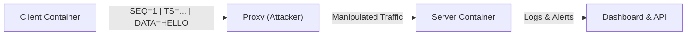

# 🛡️ MITM Detection System

> A powerful, containerized simulation environment for demonstrating Man-In-The-Middle (MITM) attacks and their real-time detection.


## 📖 Overview

The **MITM Detection System** is an educational and research tool designed to simulate network attacks in a controlled environment. It consists of a client-server architecture with an intermediate proxy that can intercept, modify, replay, or delay traffic. The system includes a robust detection engine and a modern real-time dashboard to visualize the attacks and their impact.

## ✨ Key Features

- **Real-time Attack Simulation**: Instantly switch between different MITM attack modes (Modify, Replay, Delay).
- **Live Detection Engine**: Automatically flags anomalies based on sequence numbers, timestamps, and integrity checks.
- **Interactive Dashboard**: A modern web interface built with Next.js and Recharts to visualize traffic flow and alerts.
- **Containerized Architecture**: Fully isolated components using Docker for safe and reproducible experiments.
- **RESTful API**: Full control over the simulation via a comprehensive FastAPI backend.
- **Configurable Parameters**: Adjust message intervals, delay thresholds, and payloads on the fly.

## 🏗️ Architecture

The system operates with three main Docker containers managed by a central orchestrator:



1.  **Client**: Generates structured heartbeats with sequence numbers and timestamps.
2.  **Proxy (Attacker)**: The MITM node. It can forward traffic transparently or inject faults.
3.  **Server**: The victim node. It validates incoming packets and reports security violations.

## 🛠️ Tech Stack

- **Backend**: Python, FastAPI, Scalar (API Docs), Uvicorn
- **Frontend**: Next.js, React, Tailwind CSS, Shadcn UI, Recharts, Lucide Icons
- **Infrastructure**: Docker, Docker Compose
- **Scripting**: Python (Client/Server/Proxy logic)

## 😈 Attack Modes

| Mode             | Icon | Description                                                                                           |
| :--------------- | :--: | :---------------------------------------------------------------------------------------------------- |
| **Transparent**  |  🟢  | Normal operation. Traffic is forwarded without alteration.                                            |
| **Random Delay** |  ⏱️  | **Timing Attack**. Packets are delayed by a random duration within a configured range (min-max).      |
| **Drop**         |  📉  | **Packet Loss Attack**. Random packets are dropped based on drop rate, creating sequence number gaps. |
| **Reorder**      |  🔀  | **Reordering Attack**. Packets are buffered and sent out-of-order to disrupt sequencing.              |

## 🚀 Getting Started

### Prerequisites

- [Docker Desktop](https://www.docker.com/products/docker-desktop) (running)
- [Node.js](https://nodejs.org/) (v18+ for the dashboard)
- [Python](https://www.python.org/) (v3.9+ for the API)

### Quick Start

> **⚠️ IMPORTANT: Environment Configuration Required**
>
> This project **requires** a `.env` file to function properly. The `.env` file contains critical configuration parameters for all components (Client, Proxy, Server). **The system will not work without it.**

1.  **Clone the Repository**

    ```bash
    git clone https://github.com/fdehech/MITM_Detection_System.git
    cd MITM_Detection_System
    ```

2.  **Setup Environment (REQUIRED)**

    ```bash
    cp .env.example .env
    ```

    **📝 Configuration Details:**

    - The `.env` file controls all simulation parameters (ports, delays, attack modes, etc.)
    - You can customize settings by editing `.env` before running the system
    - **Default values** in `.env.example` provide a working configuration out-of-the-box
    - See the [Configuration Reference](#-configuration-reference) section below for detailed parameter descriptions

3.  **Run the Backend (Orchestrator)**

    ```bash
    pip install -r requirements.txt
    python main.py
    ```

    _The API will start at `http://localhost:8000`_

4.  **Run the Dashboard**
    Open a new terminal:
    ```bash
    cd dashboard
    npm install
    npm run dev
    ```
    _The dashboard will be available at `http://localhost:3000`_

### Alternative: Docker Only

If you prefer not to install local dependencies, you can run the entire simulation stack (excluding the dashboard/API orchestrator) directly:

```bash
docker-compose up --build
```

## 🖥️ Usage Guide

1.  **Open the Dashboard** at `http://localhost:3000`.
2.  **Start Simulation**: Click the "Start Simulation" button to spin up the Docker containers.
3.  **Monitor Traffic**: Watch the "Live Traffic" chart and the "System Logs" console.
4.  **Launch Attacks**: Use the "Control Panel" to change the Proxy Mode (e.g., select "Modify" and click "Update Config").
5.  **Observe Detection**: The Server logs will turn red/orange as it detects the attacks.
6.  **Inspect Containers**: Expand the "Container Status" cards to view raw logs from each node.

## 📡 API Reference

The backend exposes a modern **Scalar API Reference** at `http://localhost:8000/docs`.

| Method | Endpoint             | Description                                      |
| :----- | :------------------- | :----------------------------------------------- |
| `GET`  | `/config`            | Get current simulation settings.                 |
| `POST` | `/config`            | Update simulation settings (mode, delays, etc.). |
| `POST` | `/simulation/start`  | Start the Docker environment.                    |
| `POST` | `/simulation/stop`   | Stop and remove containers.                      |
| `GET`  | `/simulation/status` | Check container health.                          |
| `GET`  | `/logs/{container}`  | Fetch raw logs from a specific container.        |
| `POST` | `/simulation/reset`  | Reset configuration to factory defaults.         |

## 📂 Project Structure

```text
MITM_Detection_System/
├── client/                 # Client container source
│   ├── client.py
│   └── Dockerfile
├── proxy/                  # Proxy container source
│   ├── proxy.py
│   └── Dockerfile
├── server/                 # Server container source
│   ├── server.py
│   └── Dockerfile
├── dashboard/              # Next.js Frontend
│   ├── app/
│   ├── components/
│   └── ...
├── main.py                 # FastAPI Backend & Orchestrator
├── docker-compose.yml      # Container definition
├── requirements.txt        # Python dependencies
└── README.md               # Documentation
```

## ⚙️ Configuration Reference

The `.env` file is the **central configuration hub** for the entire MITM Detection System. All containers and components read their settings from this file.

### Client Configuration

| Variable                  | Default                                | Description                                                      |
| :------------------------ | :------------------------------------- | :--------------------------------------------------------------- |
| `CLIENT_PROXY_HOST`       | `proxy`                                | Hostname of the proxy container (use `proxy` for Docker network) |
| `CLIENT_PROXY_PORT`       | `9000`                                 | Port where the proxy is listening                                |
| `CLIENT_MESSAGE_INTERVAL` | `10.0`                                 | Seconds between heartbeat messages                               |
| `CLIENT_MESSAGE_PAYLOAD`  | `Username=ROOT=, Password=SSHTERMINAL` | Data payload sent in each message                                |

### Proxy Configuration

| Variable               | Default        | Description                                                      |
| :--------------------- | :------------- | :--------------------------------------------------------------- |
| `PROXY_LISTEN_HOST`    | `0.0.0.0`      | Interface to bind the proxy server (0.0.0.0 = all interfaces)    |
| `PROXY_LISTEN_PORT`    | `9000`         | Port for the proxy to listen on                                  |
| `PROXY_SERVER_HOST`    | `server`       | Hostname of the target server (use `server` for Docker network)  |
| `PROXY_SERVER_PORT`    | `9001`         | Port of the target server                                        |
| `PROXY_MODE`           | `random_delay` | Attack mode: `transparent`, `random_delay`, `drop`, or `reorder` |
| `PROXY_DELAY_MIN`      | `2.0`          | Minimum delay in seconds (for `random_delay` mode)               |
| `PROXY_DELAY_MAX`      | `10.0`         | Maximum delay in seconds (for `random_delay` mode)               |
| `PROXY_DROP_RATE`      | `0.3`          | Packet drop probability, 0.0-1.0 (for `drop` mode)               |
| `PROXY_REORDER_WINDOW` | `5`            | Buffer size for packet reordering (for `reorder` mode)           |
| `PROXY_BUFFER_SIZE`    | `4096`         | TCP buffer size in bytes                                         |

### Server Configuration

| Variable                   | Default   | Description                                                   |
| :------------------------- | :-------- | :------------------------------------------------------------ |
| `SERVER_LISTEN_HOST`       | `0.0.0.0` | Interface to bind the server (0.0.0.0 = all interfaces)       |
| `SERVER_LISTEN_PORT`       | `9001`    | Port for the server to listen on                              |
| `SERVER_MAX_DELAY`         | `6.0`     | Maximum acceptable delay (seconds) before flagging as anomaly |
| `SERVER_BUFFER_SIZE`       | `4096`    | TCP buffer size in bytes                                      |
| `SERVER_DETECTION_ENABLED` | `true`    | Enable/disable the detection engine (`true` or `false`)       |

### Example Configurations

**Scenario 1: Aggressive Random Delay**

```env
CLIENT_MESSAGE_INTERVAL=5.0
PROXY_MODE=random_delay
PROXY_DELAY_MIN=5.0
PROXY_DELAY_MAX=15.0
SERVER_MAX_DELAY=8.0
```

**Scenario 2: Moderate Packet Loss**

```env
PROXY_MODE=drop
PROXY_DROP_RATE=0.2
```

**Scenario 3: Severe Packet Reordering**

```env
PROXY_MODE=reorder
PROXY_REORDER_WINDOW=10
```

## 🔧 Troubleshooting

- **Missing `.env` File**: If you see errors like "environment variable not found" or containers fail to start with configuration errors, ensure you've created the `.env` file by running `cp .env.example .env` in the project root directory.
- **Port Conflicts**: The system uses ports `9000` (Proxy) and `9001` (Server). Ensure these are free. The API runs on `8000` and Dashboard on `3000`.
- **Docker Errors**: Ensure Docker Desktop is running. If containers fail to start, try `docker-compose down` followed by `docker-compose up --build` manually to check for build errors.
- **No Logs**: It may take a few seconds for containers to initialize and start generating logs.

## 📜 License

This project is open-source and available under the [MIT License](LICENSE).
